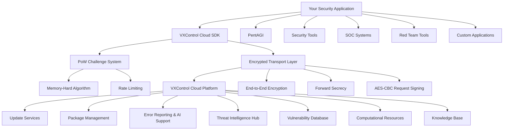

# VXControl Cloud SDK

<div align="center" style="font-size: 1.5em; margin: 20px 0;">
    Enterprise-grade Go SDK for secure integration with VXControl Cloud Intelligence Platform and Services.
</div>
<br>
<div align="center">

> 🚀 **Join the Community!** Connect with security researchers, AI enthusiasts, and fellow ethical hackers. Get support, share insights, and stay updated with the latest PentAGI developments.

[](https://discord.gg/2xrMh7qX6m)⠀[](https://t.me/+Ka9i6CNwe71hMWQy)

</div>

## Overview

The VXControl Cloud SDK enables developers to integrate their security tools and applications with the VXControl Cloud Intelligence Platform, providing access to advanced cybersecurity services including threat intelligence, vulnerability databases, computational resources, AI-powered troubleshooting, and automated update systems.

## Key Features

- **Type-Safe API**: 24 strongly-typed function patterns covering all request/response scenarios
- **Transparent Security**: Automatic proof-of-work solving and end-to-end encryption
- **Performance Optimized**: HTTP/2 support, connection pooling, streaming encryption
- **Enterprise Ready**: Comprehensive error handling, retry logic, and production monitoring
- **License Integration**: Built-in premium feature validation and tier management
- **Endpoint Health Probing**: `Check()` API for pre-flight connectivity and quota verification
- **Structured Rate Limit Errors**: `RateLimitError` / `QuotaError` carry server-advertised `Retry-After` cooldowns
- **Context-Safe Retries**: Cancelled context during back-off preserves the last `*RateLimitError` so callers can still read `RetryAfter`

## Quick Start

### Installation

```bash
go get github.com/vxcontrol/cloud/sdk
```

### Basic Usage

```go
package main

import (
    "context"
    "encoding/json"
    "log"

    "github.com/vxcontrol/cloud/models"
    "github.com/vxcontrol/cloud/sdk"
    "github.com/vxcontrol/cloud/system"

    "github.com/sirupsen/logrus"
)

type Client struct {
    UpdatesCheck  sdk.CallReqBytesRespBytes
    ReportError   sdk.CallReqBytesRespBytes
}

func main() {
    var client Client

    // Configure endpoints
    configs := []sdk.CallConfig{
        {
            Calls:  []any{&client.UpdatesCheck},
            Host:   "update.pentagi.com",
            Name:   "updates_check",
            Path:   "/api/v1/updates/check",
            Method: sdk.CallMethodPOST,
        },
        {
            Calls:  []any{&client.ReportError},
            Host:   "support.pentagi.com",
            Name:   "error_report",
            Path:   "/api/v1/errors/report",
            Method: sdk.CallMethodPOST,
        },
    }

    // Initialize SDK
    err := sdk.Build(configs,
        sdk.WithClient("MySecTool", "1.0.0"),
        sdk.WithInstallationID(system.GetInstallationID()),
        sdk.WithLogger(sdk.WrapLogrus(logrus.StandardLogger())),
        sdk.WithLicenseKey("XXXX-XXXX-XXXX-XXXX"),
    )
    if err != nil {
        log.Fatal("SDK initialization failed:", err)
    }

    // Check for updates
    updateReq := models.CheckUpdatesRequest{
        InstallerVersion: "1.0.0",
        InstallerOS:      models.OSTypeLinux,
        InstallerArch:    models.ArchTypeAMD64,
    }

    data, _ := json.Marshal(updateReq)
    response, err := client.UpdatesCheck(context.Background(), data)
    if err != nil {
        log.Fatal("Update check failed:", err)
    }

    var updateResp models.CheckUpdatesResponse
    json.Unmarshal(response, &updateResp)
    log.Printf("Available updates: %+v", updateResp.Updates)
}
```

## Architecture



## Cloud Services Integration

### Update Management
Keep PentAGI with automated update checking:

```go
import "github.com/vxcontrol/cloud/models"

// Check for component updates
updateReq := models.CheckUpdatesRequest{
    InstallerVersion: "1.0.0",
    InstallerOS:      models.OSTypeLinux,
    InstallerArch:    models.ArchTypeAMD64,
    Components: []models.ComponentInfo{
        {
            Component: models.ComponentTypePentagi,
            Status:    models.ComponentStatusRunning,
            Version:   &[]string{"1.2.0"}[0],
        },
    },
}

data, _ := json.Marshal(updateReq)
response, err := client.UpdatesCheck(ctx, data)

var updateResp models.CheckUpdatesResponse
json.Unmarshal(response, &updateResp)
```

### Error Reporting & AI Support
Get intelligent assistance for troubleshooting:

```go
// Report an error for analysis
errorReq := models.SupportErrorRequest{
    Component:    models.ComponentTypePentagi,
    Version:      "1.0.0",
    OS:          models.OSTypeLinux,
    Arch:        models.ArchTypeAMD64,
    ErrorDetails: map[string]any{
        "error_type": "connection_timeout",
        "message":    "Failed to connect to target",
        "context":    map[string]string{"target": "192.168.1.1", "port": "443"},
    },
}

data, _ := json.Marshal(errorReq)
response, err := client.ReportError(ctx, data)
```

### Package Management
Download and validate software packages:

```go
// Get package information
packageReq := models.PackageInfoRequest{
    Component: models.ComponentTypePentagi,
    Version:   "1.0.0",
    OS:        models.OSTypeLinux,
    Arch:      models.ArchTypeAMD64,
}

// Validate package integrity with signatures
signature := models.SignatureValue("base64-encoded-signature")
fileData, _ := os.ReadFile("package.tar.gz")
if err := signature.ValidateData(fileData); err != nil {
    log.Fatal("Package signature validation failed:", err)
}
```

### AI-Powered Troubleshooting
Interactive support with investigation capabilities:

```go
// Create support issue
issueReq := models.SupportIssueRequest{
    Component:    models.ComponentTypeEngine,
    Version:      "2.0.0",
    OS:          models.OSTypeDarwin,
    Arch:        models.ArchTypeARM64,
    ErrorDetails: "Scanner fails to detect specific vulnerability patterns",
    Logs: []models.SupportLogs{
        {
            Component: models.ComponentTypeEngine,
            Logs:      []string{"ERROR: Pattern matching timeout", "WARN: Memory usage high"},
        },
    },
}

// Investigate with AI assistance
investigationReq := models.SupportInvestigationRequest{
    IssueID:   receivedIssueID,
    UserInput: "The scanner works fine with other patterns but fails on this specific CVE",
}
```

## Call Function Types

The SDK supports 24 function patterns to handle different request/response scenarios:

| Pattern | Request | Response | Use Case |
|---------|---------|----------|----------|
| `CallReqRespBytes` | None | Bytes | Simple data retrieval |
| `CallReqQueryRespBytes` | Query params | Bytes | Filtered data queries |
| `CallReqWithArgsRespBytes` | Path args | Bytes | Resource-specific requests |
| `CallReqBytesRespBytes` | Body data | Bytes | Data submission/processing |
| `CallReqReaderRespReader` | Stream | Stream | Large file processing |
| `CallReqReaderRespWriter` | Stream | Writer | Direct output streaming |

[Complete function reference](https://pkg.go.dev/github.com/vxcontrol/cloud/sdk)

## Configuration Options

### Basic Configuration

```go
err := sdk.Build(configs,
    // Required: Client identification
    sdk.WithClient("MyApp", "1.0.0"),

    // Optional: Premium features
    sdk.WithLicenseKey("XXXX-XXXX-XXXX-XXXX"),

    // Optional: Performance tuning
    sdk.WithPowTimeout(30*time.Second),
    sdk.WithMaxRetries(3),
)
```

### Advanced Configuration

```go
// Custom transport for proxies/certificates
transport := sdk.DefaultTransport()
transport.TLSClientConfig = &tls.Config{
    MinVersion: tls.VersionTLS12,
    // custom certificate validation
}
transport.Proxy = http.ProxyURL(proxyURL)

// Custom structured logging
logger := logrus.New()
logger.SetLevel(logrus.InfoLevel)

err := sdk.Build(configs,
    sdk.WithTransport(transport),
    sdk.WithLogger(sdk.WrapLogrus(logger)),
    sdk.WithInstallationID(system.GetInstallationID()),
)
```

## Security Model

### Proof-of-Work Protection
All API calls require solving computational challenges to prevent abuse and DDoS attacks. The SDK automatically:
- Requests challenge tickets from the server
- Solves memory-hard proof-of-work puzzles
- Includes cryptographic signatures with requests

### End-to-End Encryption
- **Session Keys**: Ephemeral AES keys for each request
- **NaCL Encryption**: Secure key exchange using Curve25519
- **Streaming Cipher**: AES-GCM for large data transfers
- **Forward Secrecy**: Cypher key rotation

### Rate Limiting Integration
- **Adaptive Difficulty**: PoW complexity scales with server load
- **Tier-Based Access**: License validation determines API quotas
- **Intelligent Retry**: Automatic backoff with server-provided timing

## Error Handling

### Error Type Hierarchy

The SDK defines three layers of errors:

1. **Sentinel errors** — comparable with `errors.Is`, e.g. `sdk.ErrTooManyRequestsRPM`
2. **Wrapper types** — carry extra fields, extractable with `errors.As`:
   - `*sdk.RateLimitError` — wraps RPM/RPH/RPD/general rate-limit sentinels and carries the server-advertised `Retry-After` cooldown
   - `*sdk.QuotaError` — wraps license-tier quota sentinels (`Blocked`, `Daily`, `Monthly`) and carries the `Retry-After` reset cooldown
3. **Joined context errors** — when a context is cancelled during back-off, the SDK returns `fmt.Errorf("%w: %w", ctx.Err(), lastRateLimitErr)`, preserving both the context error and the rate-limit wrapper

### RetryAfterOf Helper

Use `sdk.RetryAfterOf(err)` to extract the server-suggested retry delay from any error, without needing to type-assert to `*RateLimitError` or `*QuotaError` directly:

```go
response, err := client.UpdatesCheck(ctx, data)
if err != nil {
    if wait := sdk.RetryAfterOf(err); wait > 0 {
        log.Printf("server asks to retry after %s", wait)
        time.Sleep(wait)
    }
}
```

### RateLimitError and QuotaError

```go
response, err := client.QueryThreats(ctx, body)
if err != nil {
    // Fine-grained rate-limit classification
    var rle *sdk.RateLimitError
    if errors.As(err, &rle) {
        switch rle.Scope {
        case sdk.RateLimitScopeRPM:
            // minute-window: SDK already retries automatically up to maxRetries
            time.Sleep(rle.RetryAfter)
        case sdk.RateLimitScopeRPH:
            // hour-window: fatal, do not auto-retry
            log.Printf("hourly limit reached, retry after %s", rle.RetryAfter)
        case sdk.RateLimitScopeRPD:
            // day-window: fatal, do not auto-retry
            log.Printf("daily limit reached, retry after %s", rle.RetryAfter)
        }
        return
    }

    // Quota / license-tier errors
    var qe *sdk.QuotaError
    if errors.As(err, &qe) {
        switch qe.Scope {
        case sdk.QuotaScopeBlocked:
            log.Println("endpoint not available for this license tier")
        case sdk.QuotaScopeDaily:
            log.Printf("daily quota exhausted, reset in %s", qe.RetryAfter)
        case sdk.QuotaScopeMonthly:
            log.Printf("monthly quota exhausted, reset in %s", qe.RetryAfter)
        }
        return
    }
}
```

### Automatic Retry Logic

```go
// Temporary errors (automatically retried up to WithMaxRetries):
// - Server overload (sdk.ErrBadGateway, sdk.ErrServerInternal)     → 3s backoff
// - General rate limits (sdk.ErrTooManyRequests)                   → 5s backoff
// - RPM rate limits (sdk.ErrTooManyRequestsRPM)                    → Retry-After header (capped at DefaultWaitTime=10s)
// - PoW timeouts (sdk.ErrExperimentTimeout)                        → DefaultWaitTime=10s backoff

// Fatal errors (no retry):
// - Invalid requests (sdk.ErrBadRequest, sdk.ErrForbidden, sdk.ErrNotFound)
// - Long-term rate limits (sdk.ErrTooManyRequestsRPH, sdk.ErrTooManyRequestsRPD)
// - Quota errors (sdk.ErrQuotaBlocked, sdk.ErrQuotaExceededDaily, sdk.ErrQuotaExceededMonthly)
```

The `calculateWaitTime` logic now **prefers the server-advertised `Retry-After`** value from `*RateLimitError` (capped at `DefaultWaitTime`) over fixed fallback delays.

### Custom Error Handling

```go
data, err := api.QueryThreats(ctx, []byte(threatQuery))
if err != nil {
    // Check for server-suggested retry delay first (works for both RateLimitError and QuotaError)
    if wait := sdk.RetryAfterOf(err); wait > 0 {
        log.Printf("server suggests waiting %s before retry", wait)
    }

    switch {
    case errors.Is(err, sdk.ErrTooManyRequestsRPM):
        // SDK already retried automatically; wait for server-advertised window
        time.Sleep(sdk.RetryAfterOf(err))

    case errors.Is(err, sdk.ErrQuotaBlocked):
        // Endpoint not available for current license tier, upgrade required
        log.Error("access denied — upgrade license tier")

    case errors.Is(err, sdk.ErrForbidden):
        // Check license validity or authentication
        log.Error("access denied - verify license key")

    case errors.Is(err, sdk.ErrExperimentTimeout):
        // Increase PoW timeout for slower systems
        // Reconfigure with sdk.WithPowTimeout(60*time.Second)

    default:
        log.Error("unexpected error:", err)
    }
}
```

## Endpoint Health Check

The `Check()` function probes each configured endpoint by acquiring and solving a PoW ticket **without making an actual API call**. Use it at startup or in health-check routines to verify reachability and inspect allowed RPM quotas.

### Basic Usage

```go
configs := []sdk.CallConfig{
    {Host: "update.pentagi.com", Name: "check_updates", Path: "/api/v1/updates/check", Method: sdk.CallMethodPOST},
    {Host: "support.pentagi.com", Name: "error_report",  Path: "/api/v1/errors/report",  Method: sdk.CallMethodPOST},
}

ctx, cancel := context.WithTimeout(context.Background(), 10*time.Second)
defer cancel()

statuses, err := sdk.Check(ctx, configs,
    sdk.WithClient("MyApp", "1.0.0"),
    sdk.WithLicenseKey("XXXX-XXXX-XXXX-XXXX"),
)
if err != nil {
    log.Fatal("SDK setup failed:", err)
}

for name, s := range statuses {
    if s.IsReachable() {
        log.Printf("[%s] reachable, allowed RPM: %d", name, s.AllowedRPM())
    } else {
        log.Printf("[%s] unreachable: %v", name, s.LastError())
    }
}
```

### EndpointStatus Interface

`Check()` returns `sdk.EndpointStatuses` — a `map[string]EndpointStatus` keyed by endpoint `Name`. Each value exposes:

| Method | Description |
|--------|-------------|
| `LastError() error` | Last probe error, or `nil` on success |
| `AllowedRPM() int` | Server-advertised requests-per-minute quota (0 when unreachable) |
| `IsReachable() bool` | `true` when last probe succeeded and `AllowedRPM > 0` |
| `Recheck(ctx) error` | Re-probes the endpoint in place and updates all fields atomically |

```go
// Re-probe a specific endpoint later (e.g. after a rate-limit cooldown)
if err := statuses["check_updates"].Recheck(ctx); err != nil {
    log.Println("still unreachable:", err)
} else {
    log.Println("now reachable, RPM:", statuses["check_updates"].AllowedRPM())
}
```

### Error Classification in Check

Top-level errors from `Check()` indicate SDK setup failures (crypto, invalid options). Per-endpoint failures are stored inside each `EndpointStatus` and use the same error sentinel hierarchy as regular calls:

```go
s := statuses["error_report"]
switch {
case s.LastError() == nil:
    // reachable
case errors.Is(s.LastError(), sdk.ErrInvalidConfiguration):
    log.Println("bad config — fix CallConfig")
case errors.Is(s.LastError(), sdk.ErrQuotaBlocked):
    log.Println("endpoint not available for this license tier")
case errors.Is(s.LastError(), sdk.ErrForbidden):
    log.Println("license key rejected by server")
default:
    log.Println("network/server error:", s.LastError())
}
```

## Performance Characteristics

### Benchmarks
- **License validation**: ~334,000 operations/sec
- **Function generation**: ~2M path templates/sec
- **Streaming encryption**: ~50MB/sec throughput
- **Connection pooling**: 300 connections/host, 50 total idle

### Memory Usage
- **Per request**: ~300 bytes (context + headers + keys)
- **Per SDK instance**: ~200KB (connection pools + crypto keys)
- **PoW solving**: 20-1024KB (reused across attempts)

### Optimization Tips

```go
// Reuse SDK instances across requests
err := sdk.Build(configs, options...)

// Use streaming for large data
reader, err := api.ProcessLargeDataset(ctx, dataStream, dataSize)

// Configure connection pooling for high throughput
transport := sdk.DefaultTransport()
transport.MaxConnsPerHost = 500
sdk.WithTransport(transport)
```

## Production Deployment

### Required Configuration

```go
// Minimum production setup
err := sdk.Build(configs,
    sdk.WithClient("YourApp", version),    // Required: Identification
    sdk.WithLicenseKey(licenseKey),        // Optional: Authentication
    sdk.WithLogger(productionLogger),      // Recommended: Monitoring
)
```

### Monitoring Integration

```go
// Custom logger for metrics collection
type MetricsLogger struct {
    *logrus.Logger
    metrics MetricsCollector
}

func (m *MetricsLogger) WithError(err error) sdk.Entry {
    // Track error rates by type
    m.metrics.IncrementErrorCounter(err)
    return m.Logger.WithError(err)
}

// Integration
logger := &MetricsLogger{Logger: logrus.New(), metrics: yourMetrics}
sdk.WithLogger(logger)
```

### Security Considerations

- **Certificate Validating**: Validate server certificates in production
- **Proxy Support**: Configure corporate proxy settings if required
- **Timeout Tuning**: Adjust PoW timeouts based on hardware capabilities
- **Rate Limit Monitoring**: Track API quota usage and plan capacity

## Use Cases

### Security Tool Integration

```go
// Integrate update checking into security tools
func checkSecurityToolUpdates(components []models.ComponentInfo) error {
    updateReq := models.CheckUpdatesRequest{
        InstallerVersion: getCurrentVersion(),
        InstallerOS:      getCurrentOS(),
        InstallerArch:    getCurrentArch(),
        Components:       components,
    }

    data, _ := json.Marshal(updateReq)
    response, err := client.UpdatesCheck(context.Background(), data)
    if err != nil {
        return err
    }

    var updateResp models.CheckUpdatesResponse
    json.Unmarshal(response, &updateResp)

    for _, update := range updateResp.Updates {
        if update.HasUpdate {
            log.Printf("Update available for %s: %s -> %s",
                update.Stack, *update.CurrentVersion, *update.LatestVersion)
        }
    }

    return nil
}
```

### Automated Error Reporting

```go
// Integrate error reporting into application error handling
func reportSecurityToolError(component models.ComponentType, err error) error {
    errorReq := models.SupportErrorRequest{
        Component:    component,
        Version:      getComponentVersion(component),
        OS:          getCurrentOS(),
        Arch:        getCurrentArch(),
        ErrorDetails: map[string]any{
            "error_message": err.Error(),
            "stack_trace":   getStackTrace(),
            "context":       getCurrentContext(),
        },
    }

    data, _ := json.Marshal(errorReq)
    _, reportErr := client.ReportError(context.Background(), data)
    return reportErr
}
```

### Package Integrity Validation

```go
// Validate downloaded packages before installation
func validatePackageIntegrity(packagePath, signatureStr string) error {
    signature := models.SignatureValue(signatureStr)

    // Validate file signature
    if err := signature.ValidateFile(packagePath); err != nil {
        return fmt.Errorf("package signature validation failed: %w", err)
    }

    log.Println("Package integrity verified successfully")
    return nil
}

// Validate data integrity in memory
func validateDataIntegrity(data []byte, signatureStr string) error {
    signature := models.SignatureValue(signatureStr)

    if err := signature.ValidateData(data); err != nil {
        return fmt.Errorf("data signature validation failed: %w", err)
    }

    return nil
}
```

## Advanced Features

### Multiple Service Endpoints

```go
// Connect to different service clusters
type FullClient struct {
    UpdatesCheck     sdk.CallReqBytesRespBytes
    ErrorReport      sdk.CallReqBytesRespBytes
    PackageInfo      sdk.CallReqBytesRespBytes
    SupportIssue     sdk.CallReqBytesRespBytes
}

configs := []sdk.CallConfig{
    {
        Calls:  []any{&client.UpdatesCheck},
        Host:   "update.pentagi.com",
        Name:   "check_updates",
        Path:   "/api/v1/updates/check",
        Method: sdk.CallMethodPOST,
    },
    {
        Calls:  []any{&client.ErrorReport},
        Host:   "support.pentagi.com",
        Name:   "error_report",
        Path:   "/api/v1/errors/report",
        Method: sdk.CallMethodPOST,
    },
    {
        Calls:  []any{&client.PackageInfo},
        Host:   "update.pentagi.com",
        Name:   "package_info",
        Path:   "/api/v1/packages/info",
        Method: sdk.CallMethodPOST,
    },
}
```

### Timeout and Retry Configuration

```go
// Configure timeouts for different operation types
err := sdk.Build(configs,
    sdk.WithPowTimeout(30*time.Second),  // For slower systems (max 60s, default 10s)
    sdk.WithMaxRetries(5),               // For rate limiting and network issues
    sdk.WithTransport(customTransport),  // Custom HTTP configuration
)

// Per-request timeouts
ctx, cancel := context.WithTimeout(context.Background(), 2*time.Minute)
defer cancel()

response, err := client.UpdatesCheck(ctx, requestData)
```

## Error Reference

| Error | Type | Retry | Description |
|-------|------|-------|-------------|
| `sdk.ErrBadGateway` | Temporary | Yes (3s) | Server maintenance/overload |
| `sdk.ErrServerInternal` | Temporary | Yes (3s) | Internal server error |
| `sdk.ErrTooManyRequests` | Temporary | Yes (5s) | General rate limit exceeded |
| `sdk.ErrTooManyRequestsRPM` | Temporary | Yes (Retry-After, max 10s) | Per-minute rate limit exceeded |
| `sdk.ErrExperimentTimeout` | Temporary | Yes (10s) | PoW solving timeout |
| `sdk.ErrTooManyRequestsRPH` | Fatal | No | Per-hour rate limit exceeded |
| `sdk.ErrTooManyRequestsRPD` | Fatal | No | Per-day rate limit exceeded |
| `sdk.ErrForbidden` | Fatal | No | Invalid license or authentication |
| `sdk.ErrBadRequest` | Fatal | No | Invalid request format |
| `sdk.ErrNotFound` | Fatal | No | Unknown endpoint or resource |
| `sdk.ErrQuotaBlocked` | Fatal | Never | Endpoint not available for this license tier |
| `sdk.ErrQuotaExceededDaily` | Fatal | No (Retry-After via `*QuotaError`) | Daily quota exhausted |
| `sdk.ErrQuotaExceededMonthly` | Fatal | No (Retry-After via `*QuotaError`) | Monthly quota exhausted |

> **Tip:** Use `sdk.RetryAfterOf(err)` to extract the server-suggested cooldown from any error, regardless of whether it is a `*RateLimitError` or `*QuotaError` or wrapped further in a context error.

## Available Models

The SDK provides strongly-typed models for all API interactions:

### Component Management
- `ComponentType`: pentagi, scraper, langfuse-worker, langfuse-web, grafana, otelcol, worker, installer, engine
- `ComponentStatus`: unused, connected, installed, running
- `ProductStack`: pentagi, langfuse, observability, worker, installer, engine
- `OSType`: windows, linux, darwin
- `ArchType`: amd64, arm64

### Update Service Models
- `CheckUpdatesRequest` / `CheckUpdatesResponse`: Check for component updates
- `ComponentInfo`: Information about installed components
- `UpdateInfo`: Available update details with changelog

### Package Service Models
- `PackageInfoRequest` / `PackageInfoResponse`: Get package metadata
- `DownloadPackageRequest`: Request package downloads
- `SignatureValue`: Cryptographic signature validation

### Support Service Models
- `SupportErrorRequest` / `SupportErrorResponse`: Automated error reporting
- `SupportIssueRequest` / `SupportIssueResponse`: Manual issue creation with AI
- `SupportLogs`: Component log collection
- `SupportInvestigationRequest` / `SupportInvestigationResponse`: AI-powered troubleshooting

### System Utilities
- `system.GetInstallationID()`: Generates stable, machine-specific UUID for installation tracking

## Service Tiers

### Free Tier
- **Basic error reporting**: Automated error submission
- **Package validation**: Ed25519 signature verification
- **Rate limiting**: Standard PoW difficulty

### Professional Tier
- **AI troubleshooting**: x5 investigation sessions/day
- **Package downloads**: Access to all packages
- **Rate limiting**: Reduced PoW difficulty

### Enterprise Tier
- **Advanced AI troubleshooting**: x50 investigation sessions/day
- **Custom integrations**: Specialized endpoints and workflows
- **Priority processing**: Minimal PoW difficulty and fast-track handling

## Future Roadmap

The VXControl Cloud Platform is actively expanding. Future releases may include:

- **Threat Intelligence Services**: IOC/IOA database access and threat analysis
- **Vulnerability Assessment**: CVE database integration and security scanning
- **Computational Resources**: Cloud-based intensive task processing
- **Advanced Analytics**: Security metrics and reporting dashboards
- **Custom Workflows**: Specialized security automation pipelines

*Note: These features are in development and not yet available in the current SDK version.*

## Contributing

1. Fork the repository
2. Create a feature branch (`git checkout -b feature/amazing-feature`)
3. Commit your changes (`git commit -m 'feat: add amazing feature'`)
4. Push to the branch (`git push origin feature/amazing-feature`)
5. Open a Pull Request

## Support

- **Documentation**: [API Reference](API.md) | [Examples](examples/)
- **Issues**: [GitHub Issues](https://github.com/vxcontrol/cloud/issues)
- **Enterprise Support**: support@vxcontrol.com
- **Community**: [Discord](https://discord.gg/2xrMh7qX6m) and [Telegram](https://t.me/+Ka9i6CNwe71hMWQy)

## License and Terms

### SDK License

**The VXControl Cloud SDK code is licensed under the MIT License.**

Copyright (c) 2026 PentAGI Development Team

Permission is hereby granted, free of charge, to any person obtaining a copy of this software and associated documentation files (the "Software"), to deal in the Software without restriction, including without limitation the rights to use, copy, modify, merge, publish, distribute, sublicense, and/or sell copies of the Software, and to permit persons to whom the Software is furnished to do so, subject to the following conditions:

The above copyright notice and this permission notice shall be included in all copies or substantial portions of the Software.

**What this means:**
- ✅ **Free to use** in any project (open source, commercial, proprietary)
- ✅ **No licensing fees** for the SDK code itself
- ✅ **Modify and distribute** freely with attribution
- ✅ **Integrate into commercial products** without restrictions

See [LICENSE](LICENSE) for complete MIT license terms.

### VXControl Cloud Services Access

⚠️ **Important:** While the SDK code is free (MIT), accessing VXControl Cloud Services requires a valid License Key and compliance with separate terms.

**What requires a License Key:**
- 🔑 **API Access** to VXControl Cloud Platform services
- 🔑 **Threat Intelligence** data and updates
- 🔑 **AI-Powered Support** and troubleshooting assistance
- 🔑 **Package Downloads** from secure repositories
- 🔑 **Premium Features** and enterprise capabilities

**Service Tiers:**
- **Free Tier:** Basic error reporting and package validation
- **Professional Tier:** AI troubleshooting, package downloads
- **Enterprise Tier:** Full threat intelligence, priority support

**Usage Restrictions:**
Cloud services and obtained data may ONLY be used for:
- ✅ Defensive cybersecurity and authorized security testing
- ✅ Academic research and education in controlled environments  
- ✅ Incident response and compliance assessment
- ❌ **Prohibited:** Unauthorized access, malicious activities, or illegal purposes

**Get Started:**
1. **Use the SDK:** MIT licensed code works immediately
2. **Get License Key:** Contact info@vxcontrol.com for cloud services access
3. **Review Terms:** Read [TERMS_OF_SERVICE.md](TERMS_OF_SERVICE.md) before using cloud services

### Contact

For licensing questions: **info@vxcontrol.com**  
For Terms of Service violations: **info@vxcontrol.com** (Subject: "Cloud Services Terms")
